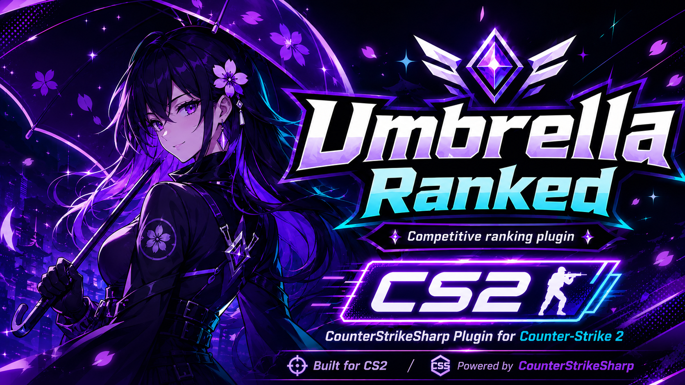

# Umbrella Ranked

Native CounterStrikeSharp ranked system for CS2.

## Features

- Rank tracking with kills, deaths, assists, KDA, points, playtime, and per-weapon kills.
- Ranking modes: `Points` or `Kda`.
- MySQL and SQLite support, selected explicitly with `DatabaseMode`.
- Internal WASD menu system for `top`, `toptime`, `topweapons`, pagination, details, and reset confirmation.
- Top-player join announcements and optional Top #1 sound.
- Autosave, disconnect save, map-end flush, and unload flush.
- Per-player command cooldown.
- Localization through CounterStrikeSharp `lang/*.json`.
- Runtime competitive toggle with `css_rank_enabled 0/1`.
- Map pattern blocking for competitive ranking while keeping playtime active.

## Commands

Player commands:

- `!rank`, `/rank`, `rank`
- `!top`, `/top`, `top`
- `!toptime`, `/toptime`, `toptime`
- `!topweapons`, `/topweapons`, `topweapons`
- `!toparmas`, `/toparmas`, `toparmas`
- `!resetrank`, `/resetrank`, `resetrank`
- `!rrank`, `/rrank`, `rrank`

Admin commands:

- `css_rank_status`
- `css_rank_prunenow`

Admin commands require `@css/root`.

## Configuration

Use [samples/UmbrellaRanked.mysql.sample.json](samples/UmbrellaRanked.mysql.sample.json) as the main template.

Important settings:

- `Enabled`: enables competitive ranking features.
- `DatabaseMode`: `MySql` or `Sqlite`.
- `RankingMode`: `Points` or `Kda`.
- `MinimumKillsRequired`: minimum kills required to appear in ranked top lists.
- `MinimumPlayersForStats`: minimum real players required before competitive stats count.
- `DisabledRankMapPatterns`: map patterns where competitive ranking is paused.
- `CommandCooldownSeconds`: per-player command anti-spam.
- `AutosaveIntervalSeconds`: periodic save interval.
- `TopCacheSeconds`: short cache for top menus.
- `AllowResetRank` and `ResetRankCooldownDays`: reset-rank behavior.
- `TopAnnouncementThreshold`: announces players who join while ranked inside this threshold.
- `Top1Sound`: optional sound playback when a Top #1 player joins.

Runtime CVar:

```cfg
css_rank_enabled 1
```

Set `css_rank_enabled 0` to pause competitive rank tracking and rank/weapon menus immediately. Playtime and `!toptime` continue.

## Points

Default point values are conservative and close to common CS ranking plugins:

```json
{
  "Kill": 2,
  "HeadshotBonus": 1,
  "KnifeKillBonus": 3,
  "TaserKillBonus": 2,
  "Assist": 1,
  "DeathPenalty": 2,
  "SuicidePenalty": 3,
  "TeamKillPenalty": 5,
  "Mvp": 1,
  "BombPlant": 2,
  "BombDefuse": 3,
  "BombExplode": 3,
  "HostageRescue": 3,
  "TeamWin": 1,
  "TeamLossPenalty": 1
}
```

Effective examples:

- Normal kill: attacker `+2`, victim `-2`.
- Headshot kill: attacker `+3`, victim `-2`.
- Knife kill: attacker `+5`, victim `-5`.
- Zeus/taser kill: attacker `+4`, victim `-4`.
- Suicide: victim `-5`.
- Teamkill: attacker `-5`, victim does not lose points.

## Database

Tables use the fixed CS2 prefix `ur_cs2_`:

- `ur_cs2_player_stats`
- `ur_cs2_weapon_stats`

`ur_cs2_player_stats.playtime` is also used by `!toptime`.

Reset rank clears kills, deaths, assists, points, and weapon stats, but preserves playtime.

## Deploy

Required plugin files:

- `umbrellaranked.dll`
- `umbrellaranked.deps.json`
- dependency DLLs beside the plugin DLL
- `lang/`
- `sqlite/` if `DatabaseMode = Sqlite`

Config path:

```text
addons/counterstrikesharp/configs/plugins/umbrellaranked/umbrellaranked.json
```

Plugin path:

```text
addons/counterstrikesharp/plugins/umbrellaranked/
```

## Project Layout

```text
UmbrellaRanked/
  Config/
  Core/
  Data/
  Menus/
  Models/
  Utils/
  lang/
  samples/
  UmbrellaRanked.csproj
  UmbrellaRankedPlugin.cs
```

Main components:

- `UmbrellaRankedPlugin.cs`: lifecycle, commands, events, menus, announcements.
- `Core/RankService.cs`: load/save/reset orchestration.
- `Core/PlayerSessionService.cs`: live session tracking and reconnect safety.
- `Core/AutosaveService.cs`: non-overlapping autosaves and flushes.
- `Menus/WasdMenuService.cs`: internal WASD menu system.
- `Data/*Repository.cs`: MySQL/SQLite repositories.
- `Data/SchemaInitializer.cs`: table and index initialization.

## Notes

- Steam IDs are stored as Steam2-style strings.
- Competitive stats require `MinimumPlayersForStats`; playtime does not.
- Disabled map patterns pause competitive ranking only; playtime continues.
- The plugin targets CounterStrikeSharp `1.0.369 or newer` and `.NET 10`.
